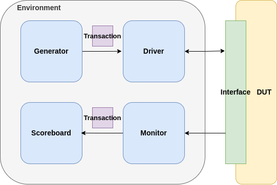

# Hardware Verification Projects (SystemVerilog)

This repository is a collection of SystemVerilog hardware verification projects. It is intended as a growing suite of layered, UVM-like testbenches for digital designs, using modern SystemVerilog features and best practices.

## Purpose
- Provide reusable, modular, and scalable verification environments for various hardware IPs.
- Demonstrate class-based, mailbox-driven, UVM-like verification methodology without requiring the full UVM library.

## Completed Projects
- **FIFO**: Design and verification environment implemented and tested.

## Planned Projects
- UART verification
- I2C verification
- SPI verification
- Bus protocol verification (AXI, AHB, etc.)

## Verification Approach
- Layered, class-based testbenches (generator, driver, monitor, scoreboard, environment)
- Mailbox-based communication between components
- UVM-like structure for easy migration to full UVM if needed

## Methodology Overview

---

Feel free to contribute or use these environments as a starting point for your own verification projects.